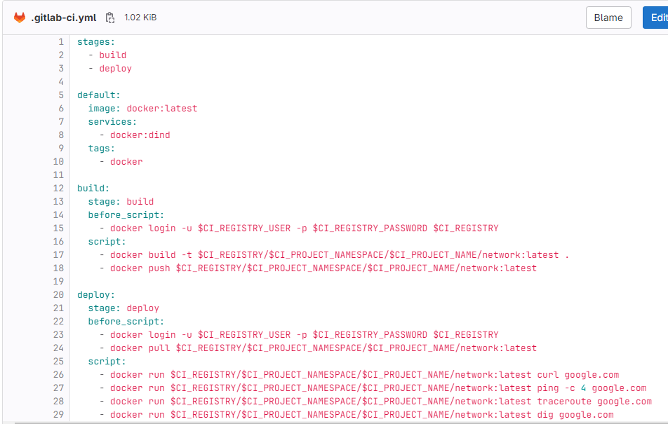
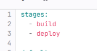
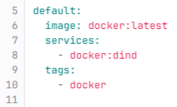
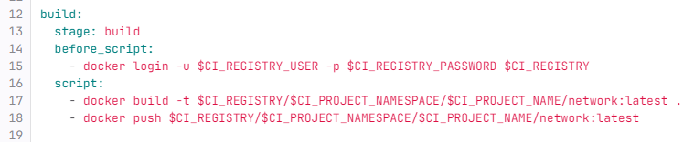
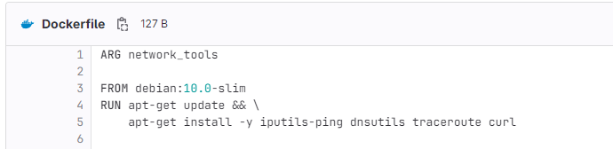
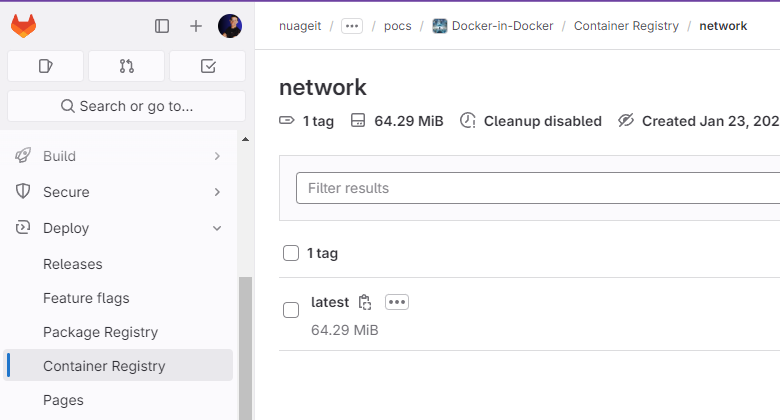
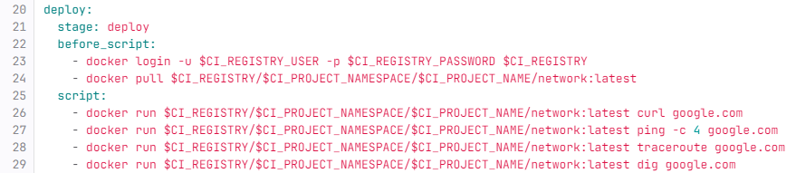

# Docker in Docker

## Tecnologias utilizadas

Docker, Gitlab CI, shared runners, Hadolint

---

## Objetivo

Este projeto tem como objetivo apresentar e exemplificar a implementação do conceito Docker in Docker (DinD) em um ambiente de CI usando o GitLab. 

A ideia principal por trás do Docker in Docker é permitir a execução de containers Docker dentro de outros containers, proporcionando flexibilidade, isolamento e eficiência nas operações de desenvolvimento e automação de pipelines.

---

## Steps

### 1 - stages

Em uma pipeline, é boa prática definir qual será a ordem dos jobs, e é com o parâmetro `stages` que fazemos isso. Neste caso, primeiro será executado o `build`, e depois o `deploy`.

### 2 - default

A palavra-chave `default` define o que será comum em toda a pipeline.

`image`: Indicamos ao Gitlab qual será a imagem que irá rodar a nossa pipeline; neste caso, a `docker:latest`, que é a imagem docker mais recente.

`tags`: Esta palavra-chave é usada para indicar ao Gitlab qual runner será utilizado; neste caso, é necessário que seja algum runner que tenha a imagem docker instalada.

`services`: Indicamos que queremos executar um container docker dentro do container docker.

### 3 - build

No job de build, utilizamos as seguintes palavras-chave:

- `stage` : O stage desse job é `build`, então ele será executado primeiro, conforme especificado no `stages`.

- `before-script` : Utilizamos essa palavra-chave para o código que será executado antes do código principal, geralmente usado para realizar alguma preparação. Neste caso, é utilizado para efetuar o login no registry.

- `script` : Aqui é onde o código principal é executado; todo job precisa ter um script. Neste caso, o script utiliza os seguintes comandos:

    - `docker build -t REPOSITÓRIO/NOME_DA_IMAGEM:VERSÃO .` : Cria uma imagem a partir do Dockerfile presente neste projeto  . Aqui, a imagem é nomeada como `network` e recebe a versão `latest`.

    - `docker push REPOSITÓRIO/NOME_DA_IMAGEM:VERSÃO` : Realiza o push da imagem para o registry, de onde ela será recuperada posteriormente.  

### 4 - deploy

Na etapa de deploy, usamos as mesmas palavras-chave usadas no build:

- `stage` : O stage desse job é `deploy`, então ele será executado por último, conforme especificado no `stages`.

- `before-script` : Realizamos novamente o login no registry para podermos recuperar a imagem que foi enviada para o registry.

    - `docker pull REPOSITÓRIO/NOME_DA_IMAGEM:VERSÃO` : Recupera a imagem que foi enviada para o registry para ser utilizada como um container dentro deste container.

- `script` : Aqui, finalmente, executamos o objetivo de todo esse repositório, que é obter dados sobre a conectividade com o site do google.com usando os seguintes comandos:

    - `docker run REPOSITÓRIO/NOME_DA_IMAGEM:VERSÃO curl`, ping, traceroute e dig: Executa os respctivos comandos dentro do container, utilizando a imagem recuperada do registry.

### Variaveis usadas: 
No arquivo .gitlab-ci.yml, coloca-se o símbolo `$` na frente das variáveis para que sejam reconhecidas. É uma boa prática escrever variáveis com todas as letras maiúsculas.

Aqui estão algumas variáveis utilizadas:

- `$CI_REGISTRY_USER` : É a variável padrão do usuário do registry do próprio Gitlab. *Não precisa ser definida antes*.

- `$CI_REGISTRY_PASSWORD` : É a variável padrão de senha do registry do próprio Gitlab. Não precisa ser definida antes.

- `$CI_REGISTRY` : É a variável padrão do registry do Gitlab, que é **registry.gitlab.com**.

- `$CI_PROJECT_NAMESPACE` : É o namespace do projeto, o "Endereço". Neste caso, é **nuageit/shared/pocs/**.

- `$CI_PROJECT_NAME` : É o nome do projeto atual, que é **network-tools** (Nome deste projeto antes de ser renomeado para Docker-in-Docker).

### Atualização
Foi adicionado o stage de quality usando a ferramenta Hadolint.
O Hadolint ele visa melhorar as boas práticas na aplicação de Dockefiles para que documentos sejam melhores escritos, diminuindo falhas e melhorando compatibilidades.

## Links Úteis
- https://devopstales.github.io/home/gitlab-ci-docker-bild/
- https://docs.gitlab.com/ee/ci/docker/using_docker_build.html
